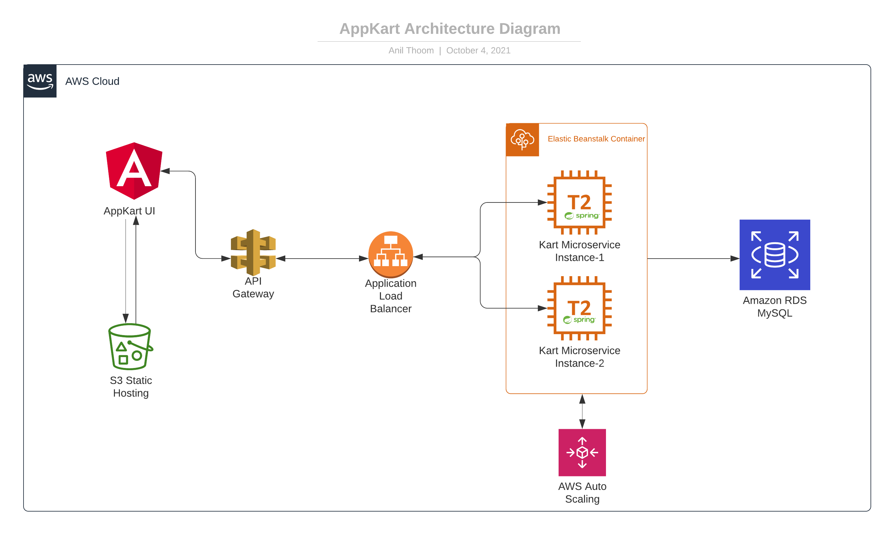

# App Kart
This is a full-stack application, developed using Angular, Spring, JPA, and MySql database.
- A global search for products
- Display products by category
- Display product details
- Add products to the cart
- Provide billing and shipping details
- Total bill calculation etc…
 

This application is hosted in AWS. Click [AppKart](http://shrikart.s3-website.ap-south-1.amazonaws.com) for the live environment.
- Angular UI application hosted as a static website in S3 bucket.
- Kart micro-service developed using Spring, JPA hosted on Elastic Beanstalk.
- RDS-MySQL is used as a data persistence layer.
   

## Architecture diagrams
### High-level Architecture Overview

### Deployment diagram

### Database diagram

